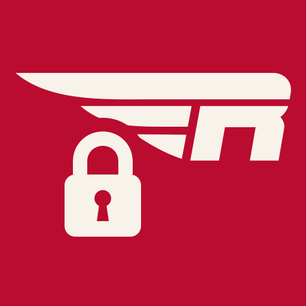

# hawk-mod



Youth-protection monitoring for the Red Hawk Robotics Slack workspace.

It is **Hawk Mod** to everyone in Slack — the app, the bot, the DM that follows
a finding — and `hawk-mod` to everything that is not a person: this repo, the
package, the container, the database file, the log lines. The slash command
stays `/hawkmod`, because it is already in people's fingers and in every
runbook.

Slack does not let us block direct messages between adults and students below
Enterprise Grid, and Information Barriers — the only feature that would — is
Grid-only. So any adult can DM any student from day one. We cannot prevent
this. **hawk-mod is the detection half of that tradeoff**, made continuous and
recorded instead of quarterly and manual.

It implements the controls in
[_Moving Team Communication to Slack_](docs/moving-team-communication-to-slack.md)
§4 and §6 — the team's plan for running on Slack, and the source of every
section number cited below.

## What it does

**Monitors DMs that include both an adult and a student** — 1:1, or any number
of each. A conversation with only students in it, or only adults, is never
recorded. Each adult authorizes hawk-mod on
their own account, granting `im:history` and `mpim:history`. hawk-mod then
receives that adult's DM events, classifies each conversation by who is in it,
and records every message in the ones that include a student — including edits
and deletions. Conversations with no student in them are classified and then
discarded; hawk-mod is not a general archive of the adults' Slack.

**Flags conversations the conduct agreement does not permit**, the moment they
appear:

| Situation                                                        | Verdict                                |
| ---------------------------------------------------------------- | -------------------------------------- |
| 1:1 DM between any adult and a student                           | violation — prohibited outright (§4.1) |
| Group DM with a student and fewer than two _screened_ adults     | violation (§4.2)                       |
| Any conversation with a student and an account not on the roster | violation                              |
| Group DM with a student and two screened adults                  | recorded, allowed                      |
| Student-only conversation                                        | **not recorded**                       |
| Adult-only conversation                                          | **not recorded**                       |

**Tracks the things that make the above meaningful**, on a nightly sweep:

- students with Slack accounts and no current parental consent (§2)
- Slack accounts with no roster entry at all
- adults whose YPP, Mentor Ready, or CORI/fingerprint checks have lapsed (§7)
- **adults who have not authorized hawk-mod, or who revoked it** — see below
- channels containing students with fewer than two screened adults (§4.2)
- fewer than two workspace owners, or a student holding Owner/Admin (§6)
- fewer than two of those Owners/Admins being screened adults on the roster (§3)

Findings are posted once to a private channel, deduplicated, auto-closed when
the underlying problem goes away, and closable by a workspace admin from
**Resolve** and **Acknowledge** buttons on the alert itself.

**The adults involved get a private nudge, not just the coaches.** When a
DM raises a finding, hawk-mod sends each adult in it a direct message naming the
rule and the concrete fix — add a second screened adult, or move it to a
channel. It is deliberately a colleague's heads-up rather than a warning: most
violations are people who did not know the rule, and an adult who feels accused
moves the conversation somewhere nobody can see it. The nudge goes once per
occurrence, it says plainly that a coach has been notified, and it never
replaces the finding.

**Students never receive one.** Youth protection governs adult conduct toward
youth; the student has done nothing wrong, and a policy notice in a minor's chat
window would frighten them to no purpose.

**Closing a DM finding closes that DM, not that pair.** If a message is sent in
the conversation afterwards, the finding is raised again with a fresh alert and
the old message is redrawn to say so. Closing it does not buy silence — only the
absence of further messages does. Merely re-reading the conversation is not a
new violation, so a conversation that has been dealt with and left alone stays
quiet however many times hawk-mod walks past it. Both open a short form asking
what happened — the reason stays mandatory, because a finding closed without
one tells the quarterly review nothing. Once closed, the message redraws
without buttons and shows who closed it and why.

_Resolved_ means someone looked into it and it is dealt with; _acknowledged_
means seen but not finished with.

**A 1:1 that gets put right is acknowledged automatically.** §4.1's own remedy
is "anything that starts in a DM moves to a channel or gets a second adult
added", so when a conversation containing the same pair plus a second screened
adult is used, the original finding is acknowledged and a note is posted in the
alert's thread. It does not matter whether that group is new or one the team
already had — Slack cannot add anyone to an existing 1:1, so either is a
legitimate way to comply. What matters is that it was **spoken in after** the
1:1 message: an old thread nobody has touched cannot clear a fresh violation.
Carry on DMing the student privately afterwards and the group stops excusing it,
because each new 1:1 message raises the finding again.

Acknowledged, not resolved: the 1:1 still happened and its messages are still
on record. Only a person marks a DM violation resolved.

## What it cannot see

Stated plainly, because a control whose gaps are undocumented is worse than no
control:

- **Adults who do not enroll.** hawk-mod sees DMs through adults' own tokens.
  A adult who never authorizes it, or who revokes it later, is invisible —
  which is why `adult_not_enrolled` and `enrollment_revoked` are themselves
  treated as violations rather than as silence. Enrollment coverage is the first
  number in `/hawkmod status` for the same reason.
- **Huddles.** Unrecorded 1:1 voice, the same problem as DMs, with no API to
  observe it. Turn them off (§6).
- **Slack Connect DMs from outside the workspace.** Disable them (§6).
- **Private channels hawk-mod has not been invited to.** Public channels are
  checked whether or not it is a member; private ones require an invite.
- **File contents.** Attachment names, types, and sizes are recorded; the files
  themselves are left in Slack rather than copied onto this host.
- **Student-to-student DMs.** Deliberately, not incidentally: FIRST YPP and the
  conduct agreement govern adult conduct toward youth, and neither asks the team
  to surveil youth-to-youth conversation. Students may not enrol, and a
  student's peer DMs are structurally invisible because no enrolled token can
  see them. A peer incident that genuinely needs investigating is reachable
  through a Corporate Export, which takes a Workspace Owner and a reason.

The Corporate Export remains the backstop for the first gap, since it captures
non-enrolled adults too. It is a manual download — Business+ has no API for it,
and the Discovery API is Enterprise Grid only — and ingesting one is **not built
yet**.

## Before you deploy this

hawk-mod records minors' private messages. That is defensible only if everyone
involved knows:

1. **Adults** sign the conduct agreement and authorize hawk-mod knowingly. The
   authorization screen names the scopes, and the success page says what is
   recorded.
2. **Students and parents** are told in the consent form that DMs are recorded
   and subject to audit (§4.3) — not merely that they are "exportable."
3. **The alert channel is private** and limited to screened adults. Findings
   name students.
4. **Access to the database is limited.** It contains message text when
   `LOG_MODE=full`. Set `LOG_MODE=metadata` to record who/when/how-many and no
   text at all; the policy violations above are all detectable without content.

Do not deploy this quietly. Covert monitoring of minors is a different thing
from an audited, disclosed control, and only the second one is what the board
approved.

## Trying it before you deploy

```bash
./scripts/setup-local.sh
```

Walks through a local run end to end: a public URL via Tailscale Funnel, the
Slack app, credentials, the container, and a test DM that should raise a
finding. It is safe to point at a real workspace **provided you only enrol
yourself and roster only accounts you control** — a conversation with nobody
rostered as a student in it is never recorded. The wizard says so at the top
and gates on it.

## Setup

1. Create the Slack app from `docs/slack-app-manifest.yaml`, replacing the
   example host with your `PUBLIC_URL`. Then upload `assets/hawk-mod-icon-512.png`
   under Basic Information → Display Information → App icon; a manifest cannot
   carry an image, so that step is manual and one-off.
2. `cp .env.example .env` and fill it in. Generate the encryption key with
   `openssl rand -base64 32` — it encrypts adult tokens at rest.
3. Create a private channel for findings and put its ID in `ALERT_CHANNEL_ID`.
   Invite Hawk Mod to it.
4. `docker compose up -d` (or `npm install && npm run dev`). For the server —
   DNS, TLS, backups, and the public-reachability requirement — see
   [docs/deploy.md](docs/deploy.md).
5. A Slack workspace Owner or Admin installs the app: visit
   `$PUBLIC_URL/slack/install`. Whoever can install it can administer it —
   there is nothing to grant afterwards.
6. Import the roster and the consents you have already collected:

```bash
npm run cli -- import-roster roster.csv
```

```bash
npm run cli -- import-consents consents.csv
```

7. Send every adult to `$PUBLIC_URL/slack/install` to enroll. `/hawkmod status`
   shows coverage; do not consider launch complete until it reads N/N.
8. `npm run cli -- backfill` to walk DM history that predates enrollment.

### Roles from Slack user groups

Set `STUDENT_USERGROUP` and `ADULT_USERGROUP` to user group handles (e.g.
`students`, `adults`) and each sweep reconciles roles from them, so membership
is managed in Slack rather than by editing a CSV. Group membership is by Slack
user ID, which removes the email-matching failure below entirely: a group
member with no roster row gets one created from their Slack profile instead of
resolving to an unknown account.

Two properties make this safe to rely on:

- **Membership is only ever added, never subtracted.** Dropping someone from
  the students group does _not_ un-student them — that would silently end their
  monitoring. The only way out of `student` is being put in the adults group,
  which is deliberate and raises a `roster_drift` finding.
- **Every role change is recorded** in `role_changes` with who, when, and from
  what. Slack's audit log API is Enterprise Grid only, so on Business+ this
  table is the sole durable trail of who was monitored when.

Being in both groups changes nothing and raises `usergroup_conflict`.

User Groups need Business+ (they don't exist on the free plan), and
**"Create and edit user groups" must be restricted to Owners/Admins** in
Workspace Settings → Roles & permissions. That setting is not readable through
any API, so it belongs on the quarterly manual checklist.

### Why a local record exists at all

Slack is the source of truth for everything Slack knows: identity, membership,
role, active status. Three things cannot live there:

- **Screening dates.** Custom profile fields are the obvious home, but below
  Enterprise Grid a member can edit their own — a adult entering their own
  CORI date is not a control.
- **Consent records.** No Slack field holds a guardian's name, a signature
  date, or a pointer to the signed PDF. And §2 obliges the team to produce
  those consents _to Slack_ on request, so they cannot live inside it.
- **The past.** Slack answers "who is a student now". An audit asks "was this
  person a student in March, when this DM happened". Deactivate an account at
  season's end and Slack forgets, while the DM log still points at them.
  `role_changes` and `screening_changes` are what survive.

So the `people` table is a compliance record whose identity fields are a
projection of Slack — not a second roster to keep in sync.

### Roster CSV

```
email,full_name,role,ypp_completed_on,mentor_ready_on,cori_completed_on,active,notes
```

`role` is one of `student`, `adult`, `district_observer` — the last being the
MPS administrator seat from §8. Nothing in this file grants access to
`/hawkmod`; that is Slack's Owner/Admin, and only Slack's. Dates
are `YYYY-MM-DD`. Email is the join key; Slack IDs are matched automatically
once people sign up. **If a Slack account's email doesn't match a roster row it
resolves to an unknown account, not a student** — which produces silence rather
than an alert, so the `unknown_account` findings that catch it must never be
left open. Slack user groups (above) avoid this entirely.

The CSV stays the way screening dates, consent, and guardian details get in;
user groups can only carry membership.

### Consents CSV

```
email,signed_on,form_version,guardian_name,guardian_email,document_ref,recorded_by
```

`expires_on` is optional and defaults to one year after `signed_on`, matching
the annual re-collection requirement. `document_ref` should point at wherever
the signed copy is actually filed.

## Commands

In Slack, restricted to the workspace's Owners and Admins — read live from
Slack on every command, so granting or revoking access is something you do in
Slack's own admin settings and nowhere else:

```
/hawkmod status | enroll | findings [kind] | whois @user
/hawkmod screening @user | consent @user
/hawkmod ack <id> <note> | resolve <id> <note> | sweep | backfill
```

There is deliberately no roster role that confers this. A student who somehow
holds Owner or Admin is refused anyway, and reported as a §6 violation.

`screening` and `consent` open a form in Slack. They are how screening dates
and consent records get in day to day — the CSV importers below are a
season-start bulk load, not a workflow. Both record who entered what and when,
and both close the finding they were fixing on submit.

On the host, or `docker compose exec hawk-mod node dist/src/cli/index.js …`:

```bash
npm run cli -- export-conversation D01ABCDEF thread.json
```

That last one is what §4.4 promises: one conversation, in full, with edits and
deletions, when a parent or the district asks for it.

## Development

```bash
npm run dev         # tsx watch
npm run typecheck   # tsc --noEmit
npm test            # node:test over the policy rules
npm run format
```

The rules in `src/domain/rules/` are pure functions and are the part with
tests. They decide whether a conversation is allowed to exist based only on who
is in it — never on what was said — so the policy is enforceable without anyone
reading a child's messages.
